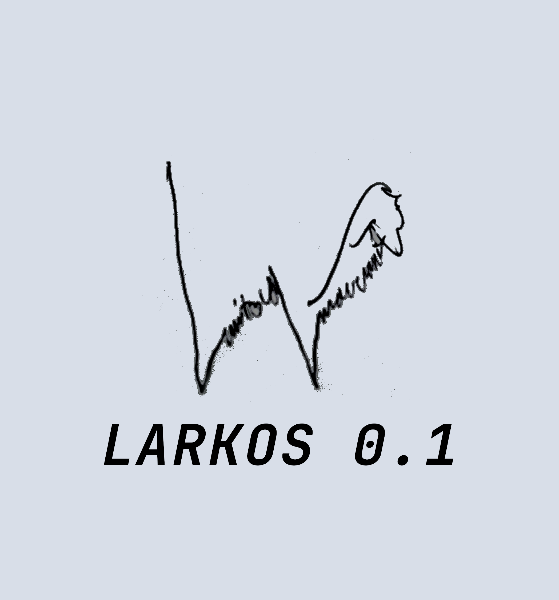

#  Larkos 0.3

Self-learning model with a state-based fusion mechanism, transformers that guide the model,
based on the <a href="https://github.com/Okerew/larkos">larkos architecture</a>.
The main parts of the architecture are the fusion mechanism, the training loop.

To understand the architecture better I recommend firstly reading the [paper](https://github.com/Okerew/larkos_0.1/blob/main/Documents/thesis.pdf) about it.

```mermaid
flowchart TB
    %% ================================================================
    %% C Backend
    %% ================================================================
    subgraph C_Backend["C Backend — neural_web.so"]
        direction TB
        N[("Neurons[MAX_NEURONS=128]\nstate, output,\nnum_connections, layer_id\nconnections[], weights[]")]
        MEM[("MemorySystem\nshort / medium / long tiers\nimportance-weighted entries\nclustering, consolidation\ncapacity-bounded replacement")]
        WMEM[("WorkingMemory\nfast scratch buffer\nconsolidates -> long-term")]
        CTX[("GlobalContextManager\nContextNode tree\nglobal_context_vector\ndecay_rate")]
        METASYS[("MetaController\nMetacognitionMetrics\nMetaLearningState\nregion priorities, cognitive load\nconfidence, error_awareness\nadaptation_rate, stability_index\nlearning_efficiency, exploration_rate")]
        MOTIV[("MotivationSystem\nperf_delta, novelty\ntask_difficulty")]
        IDSYS[("SelfIdentity\nvalues[8], beliefs[16]\nmarkers[8], history[64]\npattern, coherence_score\nstability_index\nidentity backup/restore")]
        IMAGSYS[("ImaginationSystem\nscenarios, outcomes\nplausibility, confidence\ndivergence_factor\nsteps_simulated")]
        SPECSYS[("SpecializationSystem\npattern detector\nfeature extractor\nspecialization_threshold")]
        REFLSYS[("ReflectionSystem\nconfidence_score\nconsistency_score\nnovelty_score, coherence_score\npotentially_confabulated flag")]
        NETHIST[("NetworkStateHistory\nup to 128 snapshots\nstate + input + weights\nper-step")]
        EMOSYS[("EmotionalSystem\nemotions[], intensity\ncognitive_impact\nemotion_regulation\nlove / hate / surprise types")]
        AFFSYS[("AffectiveSystem\nvalence, arousal, stability\ncomplexity, attractor dynamics\nembedding reshape")]
        BOND[("AttachmentBonds\nentity_id='training_target'\nattachment_strength\ntrust, emotional_resonance")]
        DECPATH[("DecisionPath\nselectOptimalMetaDecisionPath\noptimal meta routing")]
    end

    %% ================================================================
    %% Text Data Pipeline
    %% ================================================================
    subgraph DataPipeline["Text Data Pipeline"]
        TXTPIPE["TextDataPipeline\nnext_sample() -> str\nfile / web / synthetic\npool of 8 samples\nrotated each epoch"]
    end

    %% ================================================================
    %% Input Processing
    %% ================================================================
    subgraph Input["Input Pipeline"]
        direction TB
        BIT["build_input_tensor()\nstates[] + outputs[] +\nweights_flat[] + step_counter +\nmemory_stats\n-> INPUT_SIZE floats"]
        ONORM["_OnlineMinMax\nEMA momentum=0.02\nrunning min/max per dim\nnormalize -> [-1,1]\nclamp(-3, 3)"]
        FOURIER["fourier_encode()\nfreqs = 2^k * pi, k=0..FOURIER_ENCODINGS\nsin+cos broadcast\n-> FOURIER_OUT_DIM"]
        TWINDOW["deque(TEMPORAL_WINDOW)\nsliding history buffer\n[TEMPORAL_WINDOW, FOURIER_OUT_DIM]"]
        TEMPENC["_TemporalAttentionEncoder\nlearned pos embed [seq_len, d_model]\n+ LayerNorm\nTransformerEncoder\n(TEMPORAL_NHEAD, TEMPORAL_LAYERS\ndim_ff=TEMPORAL_DIM_FF)\nattends across timesteps\n-> [TEMPORAL_WINDOW, FOURIER_OUT_DIM]"]
        FLAT["flatten()\n-> x_temporal\n[TEMPORAL_WINDOW × FOURIER_OUT_DIM]"]

        BIT --> ONORM
        ONORM --> FOURIER
        FOURIER --> TWINDOW
        TWINDOW --> TEMPENC
        TEMPENC --> FLAT
    end

    %% ================================================================
    %% Sentence Embedding
    %% ================================================================
    subgraph EmbBranch["Sentence Embedding"]
        EMB[("EmbeddingProjector\nfrozen MiniLM SentenceTransformer\n22M params, EMBED_DIM\nLinear -> PROJ_DIM\nLayerNorm\nlast-string cache avoids\nre-encode unless text changes")]
    end

    %% ================================================================
    %% LarkosModel
    %% ================================================================
    subgraph LarkosM["LarkosModel (TransformerEncoder)"]
        direction TB
        NUMTOK["NumericTokenizer\nlearned prototypes linspace(-3,3)\nsoft-max distance -> VOCAB_SIZE weights\nweighted sum over embedding rows\n(B, D, d_model) token sequence"]
        CTX_PROJ["ctx_proj Linear PROJ_DIM -> d_model\nCLS token (B, 1, d_model)"]
        ASSEMBLE["cat([CLS, numeric_tokens])\n(B, 1+D, d_model)"]
        LENC["TransformerEncoder\nN_LAYERS, NHEAD\nDIM_FF, dropout=DROPOUT\nbatch_first=True"]
        LHEAD["head Linear d_model -> MAX_NEURONS\nextract CLS at index 0"]
        MPRED["model_pred [1, MAX_NEURONS]"]

        NUMTOK --> ASSEMBLE
        CTX_PROJ --> ASSEMBLE
        ASSEMBLE --> LENC --> LHEAD --> MPRED
    end

    %% ================================================================
    %% MC Dropout
    %% ================================================================
    subgraph MC["MC Dropout Probes"]
        MCDRP["T stochastic forward passes\nT=MC_DROPOUT_T when exploring\nT=MC_DROPOUT_T//3 otherwise\n+ Gaussian noise × 0.05 if exploring\n(no_grad, model.train() for dropout)\n-> per-output variance estimate"]
        MCBLEND["mc_blend EMA(0.9)\nraw = max(0.5 - var×0.5, 0.1)\nsmooths over per-epoch pulses"]

        MCDRP --> MCBLEND
    end

    %% ================================================================
    %% Driver Embedding Branch
    %% ================================================================
    subgraph Driver["Driver Embedding Branch"]
        direction TB
        LLMEMB["llm_embed = model_pred[:INTERNAL_DIM]\n(in-graph slice)"]
        EWN["_EmbedWeightNet\nLinear(INPUT_SIZE, 16) -> ReLU\n-> Linear(16, INTERNAL_DIM) -> Softplus\ngates how much ctx matters\nper-input-state"]
        EGATE["llm_embed_g = llm_embed × embed_gate"]
        CA["_InputCrossAttention\nq_proj: scalar input tokens (D,1->E)\nk_proj / v_proj: llm_embed_g (E->E)\nnhead=4 MHA\nout_proj: flatten D×E -> INTERNAL_DIM"]
        TPROJ["text_proj Linear GPT2_HIDDEN -> INTERNAL_DIM\n(text_encoding from distilGPT2\nfrozen, cached per sample)"]
        CAOUT["llm_embed_ca = cross_attn + text_proj_out\n(INTERNAL_DIM)"]
        AUXP["aux_proj Linear INTERNAL_DIM -> MAX_NEURONS\ngradient path for cross_attn /\nembed_weight_net / text_proj\nacross C boundary"]

        LLMEMB --> EGATE
        EWN --> EGATE
        EGATE --> CA
        TPROJ --> CAOUT
        CA --> CAOUT
        CAOUT --> AUXP
    end

    %% ================================================================
    %% GAT
    %% ================================================================
    subgraph GAT["_NeuronGraphReasoner (GAT)"]
        direction TB
        BF["build_graph_inputs(neurons)\n8-dim node features per neuron:\n[0] state  [1] output\n[2] layer_id==0  [3] layer_id==1\n[4] tanh(num_conn/MAX_CONN)\n[5] state - prev_state (velocity)\n[6] |output| (magnitude)\n[7] tanh(mean_outgoing_weight)\nadj_mask[N,N] bool + edge_weight[N,N]"]
        GNLIN["node_in Linear D_NODE -> d_out"]
        GNEMB["neuron_embed [MAX_NEURONS, d_out]\nlearned, std=0.02\nbreaks node symmetry\nadded after node_in"]
        GATL["_GATLayer × GAT_LAYERS\na_src + a_dst per-head vectors\nLeakyReLU(0.2) score\nmask non-edges to -inf\nedge_weight gain: score×(1+tanh(w))\nsoftmax → weighted aggregate"]
        GNORM["LayerNorm + residual after each layer\nELU activation"]
        GTOK["graph_tokens [1, MAX_NEURONS, d_out]"]

        BF --> GNLIN
        GNEMB --> GATL
        GNLIN --> GATL
        GATL --> GNORM --> GTOK
    end

    %% ================================================================
    %% Cognitive Fuse (C side)
    %% ================================================================
    subgraph CogFuse["cognitive_fuse() — C side"]
        direction TB
        LLM_EMB_C["llm_embed injection\nsplitmix64 deterministic hash\n-> project -> layer_norm\n-> q [FUSION_DIM=64]"]
        TXT_C["text_embed injection\ndistilGPT2 hidden -> proj\n-> project + layer_norm\n+= 0.5 × text_proj into q"]
        Q_VEC["q vector FUSION_DIM=64"]
        DW_C["default_weights [MEMORY_VECTOR_SIZE=22]\ncurrent system state prior\n(neuron_pred / cached target)"]
        MBLEND["importance-weighted memory blend\nblended = (1-r)×DW + r×mem.v\n× mem.importance\nr = mem_weight_ratio"]
        KPROJ["project keys\nlayer_norm"]
        TOPK["Top-K Attention\nq × keys × scale\nkeep top-32 entries\nsoftmax → weighted sum\n→ mv [FUSION_DIM]"]
        BQ_C["Band Q  [0 : BAND_Q=32]"]
        BM_C["Band M  [BAND_Q : FUSION_DIM=64]"]
        XMIX_C["cross-band mixing\nmix = sigmoid(ctx_factor×2-1)×0.5\ncross_i = f_i + mix × f_partner"]
        FRAW["fused_cog_raw [FUSION_DIM]"]
        FCNORM["_OnlineMeanStd\nEMA momentum=0.02, std_floor=0.1\nre-center fused_cog each epoch\nclamp(-3, 3)"]
        FBANDS["band_q [BAND_Q=32]\nband_m [BAND_M=32]"]

        LLM_EMB_C --> Q_VEC
        TXT_C --> Q_VEC
        Q_VEC --> TOPK
        DW_C --> MBLEND --> KPROJ --> TOPK
        TOPK --> BQ_C
        TOPK --> BM_C
        BQ_C --> XMIX_C
        BM_C --> XMIX_C
        XMIX_C --> FRAW --> FCNORM --> FBANDS
    end

    %% ================================================================
    %% Fusion Transformer Head
    %% ================================================================
    subgraph FusionHead["_FusionTransformerHead"]
        direction TB
        PRJQ["proj_q  Linear BAND_Q -> d_model"]
        PRJM["proj_m  Linear BAND_M -> d_model"]
        PRJD["proj_driver  Linear INTERNAL_DIM -> d_model"]
        TTYPE["token_type_embed [4, d_model]\ngraph(0) / q(1) / m(2) / driver(3)\nshared across all 128 graph tokens"]
        SEQF["sequence [MAX_NEURONS+3, d_model]\ngraph_tokens + type_graph\n+ q_tok + type_q\n+ m_tok + type_m\n+ driver_tok + type_driver\ninput_norm + Dropout\n+ noise×0.005 (training only)"]
        FENC["TransformerEncoder\nFUSE_GRAPH_LAYERS, FUSE_GRAPH_NHEAD\nFUSE_GRAPH_DIM_FF, dropout=0.1\nbatch_first=True"]
        POOL["Learned-query attention pool\npool_query param [d_model]\nscores = enc @ pool_query / sqrt(d)\nsoftmax over seq-len → weighted sum\n→ [B, d_model]"]
        FHEAD["linear_out Linear d_model -> MAX_NEURONS"]
        FOUT["fused [1, MAX_NEURONS]"]

        PRJQ --> SEQF
        PRJM --> SEQF
        PRJD --> SEQF
        TTYPE --> SEQF
        SEQF --> FENC --> POOL --> FHEAD --> FOUT
    end

    %% ================================================================
    %% MAML
    %% ================================================================
    subgraph MAML_BOX["MAML Inner Loop"]
        direction TB
        FMODEL["fast_model (persistent clone)\nshares frozen MiniLM ST encoder\nonly trainable params refreshed\n(avoids 22M-param deepcopy)"]
        INNERSGD["inner SGD\nMAML_INNER_STEPS=5\nlr=MAML_INNER_LR=0.01\nloss = MSE(pred, target)\nx_temporal detached (no graph bleed)"]
        MAPRED["maml_pred [1, MAX_NEURONS]"]

        FMODEL --> INNERSGD --> MAPRED
    end

    %% ================================================================
    %% Loss & Optimization
    %% ================================================================
    subgraph LossOpt["Loss & Optimization"]
        direction TB
        OLOSS["outer_loss = SmoothL1(maml_pred, target)\nbeta=0.1"]
        BLOSS["base_loss  = SmoothL1(fused, target)"]
        PLOSS["pred_loss  = SmoothL1(model_pred, target)"]
        ALOSS["aux_loss   = SmoothL1(aux_proj(llm_embed_ca), target)\ngradient bridge across C boundary"]
        TOTLOSS["total = mc_blend × outer\n+ (1-mc_blend) × 0.4 × base\n+ (1-mc_blend) × 0.3 × pred\n+ 0.2 × aux"]
        GBAL["Grad balancing\nEMA of fusion_transformer grad norm\nif ft_norm/ewn_norm > 10:\n  scale ewn grads by min(ratio/10, 5)\nruns before global clip"]
        GCLIP["clip_grad_norm_(all_params, 1.0)"]
        OPT["AdamW\nlr=BASE_LR, weight_decay=1e-4, eps=1e-6\nparams: model + fusion_transformer +\ngraph_reasoner + temporal_encoder +\nembed_weight_net + cross_attn +\ntext_proj + aux_proj"]
        SCHED["CosineAnnealingLR\nT_max=COSINE_T_MAX, eta_min=1e-5"]
        EMAW["EMAWrapper decay=EMA_DECAY\npolyak averaging of model weights\napply_shadow / restore for inference"]

        OLOSS --> TOTLOSS
        BLOSS --> TOTLOSS
        PLOSS --> TOTLOSS
        ALOSS --> TOTLOSS
        TOTLOSS --> GBAL --> GCLIP --> OPT
        OPT --> SCHED
        OPT --> EMAW
    end

    %% ================================================================
    %% Freeze Cache & Default Weights
    %% ================================================================
    subgraph FreezeCache["Freeze Cache & Default Weights"]
        direction TB
        CTGT["_cached_target\nneuron_pred (current neuron outputs)\nrefreshed every TARGET_FREEZE_INTERVAL\nused as training target"]
        CFUSE_D["_cached_fused_cog\n_cached_driver\n_cached_graph_inputs (nf, adj, ew)\nall pinned together on same schedule\nGAT still runs in-graph on frozen inputs"]
        SKIPFLOOR["frozen_skip_floor = 0.15\nif in_frozen_window and loss < floor:\n  skip optimizer.step()\nprevents sawtooth gradient pulses\nfrom over-memorized frozen pairs"]
        ALPHA_CTX["derive_alpha_from_context()\nmean|global_context_vector|\n-> mem_weight_ratio ∈ [0.3, 0.7]"]
        DLR["derive_lr(meta_state)\nconfidence × stability (divisor floor 0.25)\nerror_awareness × exploration (multiplier)\ncog_load dampens\n-> dynamic lr ∈ [1e-5, 2e-3]"]
    end

    %% ================================================================
    %% Text Codec (Debug Readout)
    %% ================================================================
    subgraph TextCodecBox["_TextCodec  (debug readout only — not trained)"]
        direction LR
        TXTENC["encode(text)\ndistilGPT2 transformer hidden states\nmean pool -> GPT2_HIDDEN\nfrozen, cached as text_encoding"]
        N2P["_num_to_prefix (frozen random proj)\nFUSION_DIM -> N_PREFIX × GPT2_HIDDEN\nrescale to wte mean/std\nfiltered if std < 1e-3"]
        TGEN["generate()\nprefix + anchor_text embeddings\ntemperature=0.8, TEXT_MAX_NEW tokens\nskip if prefix not finite"]
    end

    %% ================================================================
    %% Side Effects (per-epoch C triggers)
    %% ================================================================
    subgraph SideEffects["Side Effects — per-epoch C backend triggers  (_side_effects)"]
        direction TB
        SE_MEM["add_memory_step(fused_np)\nconsolidateToLongTermMemory\ncaptureNetworkState -> NETHIST"]
        SE_META["update_meta(region_scores)\napplyMetaControllerAdaptations\n(weights + neuron activations)"]
        SE_REFLECT["run_reflection()\nperformSelfReflection(neurons, mem,\nstate_history, reflect_hist)\n-> confidence, drift, novelty, coherence"]
        SE_NEURON["process_neurons(scale=0.6)\nupdate_neuron_states(scale=0.6)\nSIMD tanh (Apple Accelerate)\nstate = decay×prev + Σ weighted_input\n+ recurrent + neighbour_influence\nHebbian: Δw = η×pre×post - decay×w"]
        SE_MOTIV["update_motivation(\nperf_delta, max(novelty, reflect signals)\ntask_difficulty=min(loss,1))"]
        SE_IMAG["update_imagination_creativity(perf_delta, novelty)\nproblem_solve_with_imagination(loss):\n  createScenario(div=0.6)\n  simulateScenario(15 steps)\n  blendImaginedOutcomes()\n  nudge neuron states 30%\nstore_best_to_memory() every 30 epochs"]
        SE_ID["update_identity(fused_np)\nverify_identity()\n  -> analyzeIdentitySystem if fail\n  -> restoreIdentityFromBackup"]
        SE_SPEC["detect_specializations(neuron_pred)\napply_specializations()\nupdate_specialization_importance(\n  perf, error_rate)\nevaluate_specialization_effectiveness"]
        SE_EMO["detect_emotional_triggers(neuron_pred, satisfaction)\ntrigger_emotion(type, strength)\n  love if delta>0.03\n  hate if delta<-0.03\n  surprise if novelty>0.7\napply_emotional_processing(lr, plasticity)\nupdate_attractor_dynamics()\nupdate_affective_complexity()"]
        SE_BOND["update_bond(\n  attachment = 0.7×0.5 + 0.3×(1-loss)\n  trust = 0.5×satisfaction + 0.5×coherence\n  valence = clamp(loss_trend×4, -1,1))"]
        SE_MASK["compute_mask_intensity\nh_iga(aff_sys, emo_sys, person_id)"]
        SE_LOG["log_epoch / log_context\nlog_history / log_memory"]
    end

    %% ================================================================
    %% Data flow connections
    %% ================================================================

    %% C backend -> Input
    N --> BIT
    MEM --> BIT

    %% Input pipeline internal (already declared above with arrows)

    %% Text pipeline
    TXTPIPE -->|"next_sample() -> str\ncurrent_text_input"| TXTENC
    TXTPIPE -->|"anchor_text"| TGEN

    %% Sentence embedding
    TXTENC -->|"text_encoding GPT2_HIDDEN"| TPROJ
    TXTENC -->|"embed_ctx string"| EMB

    %% LarkosModel inputs
    FLAT -->|"x_temporal"| NUMTOK
    EMB -->|"ctx_raw PROJ_DIM"| CTX_PROJ

    %% MC dropout also uses x_temporal + embed_ctx
    FLAT -->|"x_temporal (no_grad)"| MCDRP
    MPRED -->|"model in train mode"| MCDRP

    %% Driver branch
    MPRED -->|"squeeze(0)"| LLMEMB
    ONORM -->|"x_norm [INPUT_SIZE]"| EWN
    ONORM -->|"x_norm [INPUT_SIZE]"| CA

    %% GAT inputs from C backend
    N -->|"neurons dict"| BF

    %% Cognitive fuse (C)
    CAOUT -->|"llm_embed_ca.detach()"| LLM_EMB_C
    TXTENC -->|"text_encoding.detach()"| TXT_C
    MEM -->|"mem_state"| MBLEND
    CTGT -->|"default_weights"| DW_C
    ALPHA_CTX -->|"mem_weight_ratio r"| MBLEND
    CTX -->|"context_factor = alpha"| XMIX_C

    %% Freeze cache
    N -->|"neuron outputs -> neuron_pred"| CTGT
    METASYS -->|"meta_state"| DLR
    CTX -->|"global_context_vector"| ALPHA_CTX

    %% CogFuse -> FusionHead
    FBANDS -->|"band_q [BAND_Q]"| PRJQ
    FBANDS -->|"band_m [BAND_M]"| PRJM
    CAOUT -->|"driver_for_tf (or cached)"| PRJD
    GTOK -->|"graph_tokens [1,N,d_out]"| SEQF

    %% MAML
    FLAT -->|"x_temporal.detach()"| FMODEL
    MPRED -->|"outer model params copy"| FMODEL
    CTGT -->|"target"| INNERSGD

    %% Losses
    MAPRED --> OLOSS
    FOUT --> BLOSS
    MPRED --> PLOSS
    AUXP --> ALOSS
    CTGT -->|"target"| OLOSS
    CTGT -->|"target"| BLOSS
    CTGT -->|"target"| PLOSS
    CTGT -->|"target"| ALOSS
    MCBLEND -->|"mc_blend weight"| TOTLOSS

    %% DLR -> optimizer
    DLR -.->|"dynamic lr override"| OPT

    %% Text codec readout (debug)
    FRAW -->|"fused_cog_raw FUSION_DIM"| N2P
    N2P --> TGEN

    %% Side effects receive outputs
    FOUT -->|"fused_np"| SE_MEM
    FOUT -->|"fused_np"| SE_ID
    MPRED -->|"model_pred_np"| SE_LOG
    CTGT -->|"neuron_pred"| SE_EMO
    CTGT -->|"neuron_pred"| SE_SPEC
    SE_REFLECT -->|"reflect signals\nnovelty, drift, conf, coherence"| SE_MOTIV
    SE_REFLECT -->|"1-conf -> creativity"| SE_IMAG

    %% Side effects update C backend
    SE_NEURON -.->|"state + weight refresh"| N
    SE_MEM -.->|"memory entries refresh"| MEM
    SE_MEM -.->|"snapshot"| NETHIST
    SE_REFLECT -.->|"metrics"| REFLSYS
    SE_META -.->|"priority adaptation"| METASYS
    SE_MOTIV -.->|"motivation update"| MOTIV
    SE_ID -.->|"identity update"| IDSYS
    SE_IMAG -.->|"nudge neuron states 30%"| N
    SE_IMAG -.->|"best scenario -> memory"| MEM
    SE_IMAG -.->|"imagination state"| IMAGSYS
    SE_SPEC -.->|"specialization update"| SPECSYS
    SE_EMO -.->|"emotional state"| EMOSYS
    SE_EMO -.->|"affective state"| AFFSYS
    SE_BOND -.->|"attachment bond"| BOND
    SE_LOG -.->|"epoch / context / history / memory logs"| SE_LOG

    %% Styles
    style C_Backend fill:#1a1a2e,color:#eee,stroke:#e94560
    style DataPipeline fill:#0d2137,color:#eee,stroke:#4a9eff
    style Input fill:#16213e,color:#eee,stroke:#0f3460
    style EmbBranch fill:#16213e,color:#eee,stroke:#0f3460
    style LarkosM fill:#1b2a4a,color:#eee,stroke:#4a9eff
    style GAT fill:#0f3460,color:#eee,stroke:#e94560
    style CogFuse fill:#533483,color:#eee,stroke:#e94560
    style FusionHead fill:#2d4059,color:#eee,stroke:#e94560
    style MC fill:#1a2040,color:#eee,stroke:#888
    style MAML_BOX fill:#1b3a2f,color:#eee,stroke:#4ae980
    style LossOpt fill:#1b1b2f,color:#eee,stroke:#e94560
    style FreezeCache fill:#16213e,color:#eee,stroke:#e94560
    style TextCodecBox fill:#2a1a2e,color:#eee,stroke:#9a4560
    style SideEffects fill:#1a1a2e,color:#eee,stroke:#e94560
    style Driver fill:#2d4059,color:#eee,stroke:#e94560
```

[You can see larkos 0.3 the architecture better here](https://mermaid.live/edit#pako:eNq1XGtyG8mRvkoFHbYbFsC3NBLDnFgQACl48OAA0EhjittRQBeAHjW6oe6GKI7piP214d8bjtAB9hB7AP33IXyS_TKrql8ER1rvUD9EoF5ZlZXvzMJfdmaRp3ZOduZBdDNbyjgVk7O3ocC_3_5WnP4__2ULtcSZnL1TofcrL51spotYrpei5RoAV293MmDin__xdxGqTSwD90ZNd5Po7c61nkj_PD9Ws9SPwuzI9G9w5bzdGWBSFCZX_eYbd9B5NRoOxqcHh8-v374Nk1Smqi6iTbrepHU0hJuVO4vCUK-V1EUgb1Xs-h76Cu1X13Vxo_zFMsXHtzu1wkb6nT4B7atVFN-Ob5NUrQjQMsJt7ImV8vzNCh-CKFyI1Fdxgl5_tUa3DGeqoVdVnlBhGvuKemfBBqvEfrioC-whiQLfk7QN6pNrOfPT28Y02oQepsVqHciZWmF6eV-vzcZeR_E7LKX3hxXmMklFMotlOluK6WY-V7E-q4GjEtH4lrfbwCZW5UVbkze05kUQTWXQisJUfUz7MpQLXsQ0DECUIo2VQtOCRxKKqcf9AHxGNNRTM3nrYhOqis1Jc_zjWGM0lbRiHAUBL08Ns2gR-oQLfIn9WWKae0rGIU45pvtFW6wWRBrr2I9iDFcJYZJnflA4mzTXO_c9hUuoCxXHUezKGxmrUCW0qvTkOmWs8y7rAqQz9QOg3vWx-48YEhigrprP_ZmPlW6x0sd1EMX5xMrxhpPuD3y4CFvhURnJrFU8dz0VpLIuwugDPtB1pTJ553o-QdhQS2m5btvgaqyCeRdnSX2e9EEGG5VcPQfVTlXgq3lydfCM6H8l43cgQe5Z-gnu4vbq2TH1rGWK6w4JT0sVE1bcZBbFSjNN5eS-ASWm4NXNei9WtFTlrN1-88Jsr7uSCz8sHzeZqVDifhJmx1m0YtoHMW8SX4Nj6jdXRCSDu4sXvLO5NGSEtdaJm_irTQBce-UNjC87LYuftZr5MvB_rqBcH1p4KrWEOVcy3cQK95jGGZTSbDdd4rzLKKiAG3XOewbcSM0DLTkyUPlRMrwSz-EOiG6yNnPx-vu2y1hHKeFeBsEtcdVcTvXRxTyQi_KGBp3Jy-54okViegM5wOzxUt871tqsRRoJiEaRhHKNI6WJlZHiifBDyEj8NXJPU2iDMF4G0-kPzbE7q4jOLIPs1Eq3sPz0IQJwYCbQjBldiEKgOR_qgnXpRFrcBUAHhOeSdrQHhRGDoxMIl9s1qKW0i-b5udlFEyJtRmtnuwA7aDaXcbRJZFBgZt7Lah2oj0xwoAd968K7DeVKCxi1mirPA6MLune5rtD52XDQZrgpxNOSBPFZFHo8kZkEyuT091jWZ1mRStBw-nuSMNl4N4G0DBfpkvg9hvCHGLGoBD4S_CUWKEFtd1qXzclLAtwGdSYYfCl5hUQR7Q3Xqb-SAQnHSn-ke6CaUimAkBTbytdmNf_r2xAT8JNoS0C89NcQSaF6LGOCgFgYsCe2AC6aEZM3k8vuZccMLM4lZiSVlUgiD6dGWhH3RCLCD4gaYZQQTd6G6VKl_ox5MwpENBfgJ55ENBBHKbOnwl0LtY5mywz-I6G6y3x7GUczaDK620dCNMMB4gy8bdjdbqSddSeYNt34geeykHFJMESxU7PSB_ICgkdbafwZHUYMuZBzKXeTJIII3ECsxDxixSaOSysQ5nFf3cHlq4k77v65A_EYUXNxd8PBcNTHTtxhSDvv-2Ffknbr9JtiFRFjblan-7v7h3SNm5DYV6z8cG8lPwqIQpxuxRI7XpFuUEQgV42D-sE123CgAKdxVBdHtRLQ8-GrUbczAth5tIHBF7sQTTCY-PDzWL1PxKk4_Pd34g9i7dfFO2xg18xxO4PWsN0dXIwJT374ZBYlYhrDmpnBptMntkOHOHe72y_T-uvuoD18DdCeer9RzqTTvxyOmj1XtzP2YQLSMY1tkNuHV5XB9Sqk6zIojMZuCbkTRcauDCAeSR5GYYfPG1sDCryxxjlYyIqrRL13IazrwnNXGBUQLp-IHhnlAyAa3yaxDJM5Pqs4Xyk_y-Blp9mui-x7r_ljZzRm82HlzuenWQf27J6f17QgBismQs7iKElgpMMUIbtCY_T_ePLzXpOom6gUq_KtYpGPIHGNhi24FJ8_bV-zxDKigXWYZCsUzB1m_j06405z8fcoQXfqq7p3d3pZnOZRhdVYkVUwU6JjlexjiSsAOAPpzJZXZC7fg7pTsmjOtDljOiFLf8rswzj6WYUCwsLv9bPtF4gSYw4P-2ItY7mCbYu1Om1mxbdhD1JGxiQnLkfDP9nGAm0H4GNYWOT6iRkUhhLyQ-SzLRGrhhYUYgO-ITIlxQanP1wUTaFHuqYe_IYo6RNHPtb9GBC4nQIw4dxn99rXxAFe9SfD77DWYIOJ_mwSvVMhZHRJ6kA1R2xJCoj_BGaoIoF9xHIwmqcNkvMeBCEZX3RpPwxbzTOtTXKbOPPfE7j5sFZjUTAXoxsa4pzVRTuTaDXY3NiMSEgGs1lX9q9dog3sfJZ-dLHFn4ShGksytBOzFLncvbFZj6Ac5FBKyzbHY9Bhj8ycmUydK8yCj6lR4_L05LpmdnrwpP3AKj0t0bcK4IERtHXBAhgtWr5iqThaQ5OftkfDS0g39Ewp9ODO_ThJTyfxpoyBHk0HlKWSnj262Q2dvBDTIQNbO2mCsCBTwe6p2C-t178cdWg9XgEIJSUDNBXWqcpaTTss_ize7l_QA922hbt7VorymfgT7-ZRObXfEm2N8cdi1D4RQQ6GLM2pKltW_VZ7dEmkAiMNFi-kmj8TIJkbGYPvZJKwaTw57bdcQxbuRNwsQcU6fEICudq_t3ckIpja8Q08QLYKLuQGBq4MRRiRUwgtCmPtqfDnpVWcMHKxca8umAR22RODOT8nJ08fwShpcm-1zSk-yNhntoclAGcpVZXj4YoHTFUzdxpQsBI2o7O_-4JWiuUNTDgIDzQ8FQ1a6_MnfKxjewcsXFYRDpJoaUFA2S0Q602QGDxWMKlJRwN9VOJpxxRjybWi0Brz0Vw1Bgc0PgT3y4K-1-uTtn67EwQrV9uQpyLn9auT7mDSGQ20vUfGpOOHDQ0dtu5MlSVc5_WATFbex2sW7AOVZorbyd0JiMln7BGOVO-Vph4z5uBZXRRh8qgx1Mk62BDRLzjCuoxuxGqDS4eUB6lQFMoGWNgjarAbVN7bRXPSKR7UXeCo-bFB_qa5OrPVpEOxm9YiCzezxAHxPeuYE5HMZABJq2M-WiMIp10_aHzbIZJ9p1XRnvhgxhd34XTMqJCE9umx6L9sUpwBjp0ebIxh0f78qSPYLcvxU3YbjO7jWHFR-V1cTg7dl912uzO4twDulMezeUTEAxNtxYrbD2heZrTVtU3lsfOmPfRaBVGQNCUUzyRwzG6BiyOE8DqzrbkkYgG7dNllrfvqDQlBuSkr8uKE-yqNRJWP64GYTJcspArg92w0ytVmhxsqSjJkeyJnRjsxLcEJAhnfVgSKZhiWKExRJeLf2kxfuaPVrNyUaSWtXsDh9lZ81ToTSHlUGXZhPZZfX15dsGvn6vzSBTWNlEyiEOTkoO9rDNOz8yz0wWvqAEjihDpnRVz0vAFXFToNpr4JRidMsXrICTmQ-9dCR2lhy1ybOAm1H15n-avT0330HhUbDmjI8bWAQbt0bOJrj8ivNRwMCPTVU7twA-ax-uDqL84HFUSUdeIxz67FnQZ5J5yVpEDuxlPc9Y1ZfKVkSPyxiCjkqWmVPW3vJ3clk3dXg_rgGhQaBeAo5S2UGcPtJSxeDHpdksmEDuDK8lDbHQzbHW0KEx-Wp2iNoPFlpGMxGVjXk65zX4ACwp4N9UxjJd8l-gKS29VKpRwslx6l2-Scok1mN2WwzUmPqIP-EspJIONzHoCQbhLPcF7peknKep9tXJ0SI-nfA9xbUigwHA5rwkb8CWGAGDYIUQlF7KEj5iQJcsSJBYyaEz3l8yfn4Alfw03N-jLkyvzzP_9LZN6KXCxidU9TXJiIWOaTYrsgP9_byMAcneOYTFMUKeu9EnJmM1nlpbT_pYncKJSK4Z3dQyXWcc6Cgm--cqu6AwiuEMi2dnwz69gYCW3pUUVPK0sxnm9gkDotAdSBMx4rbR4tCA45dVk6ZY4GGLeUO9fQv86GcoFct1Uyo_zwJz2WE2CBn678j8-OOVUWr_zQZ5sepv3SGM86RsK5Y5Y4oQ5p4Pt7cXX-atwdDkjjnVK6sRKBZ8hah98DnetxsfTBgqEwwMpgn5ShPjkVZHyDBXNTwg_BOu9LsL93f-gQ7PeGC0Vpn6Wh7de8S0_N5SZIDduBpKFNh6MfaZ3JcMS24enhIUeAN3FMejzhLJQRq5yQZqdECyf2R_esXaJzQ2U10reuxraaAR3xFuyCkOSiv2wBOweNuPb5U_s1MfDnTxi3-wEDgA_6mC9F7goZzGplLQpOXZd28J0xyiyq36nbhGNVGb5L1zm8JL6fROvGd6JkadJt0Fz6S-YmAX-nFOUg142jw0IBxFaJlWzoYqlp9aFIUGVqOvuer-lMwif7HgpwX5yIs-ag7X5_enRYGdrPh_YxVA_D-F8g1jf97huexVZWY0pzwRfa08QH4DLxF6vI9xyK3-g89edPh42DGvuARBdszvkYOcf_T2g6YWTurmWcwpQoR5NHTYrXE1fDGI0WLjmXDx7-vFXJaEANj1NvW0qDNZ47D6IoxvcDHWCcKc6lZNCKSatfSmkQ5sZk1wAd7nuLSUY4RXvQuDKN_ewWtogfFtLMkhXpsK2Dv-oANiiuzKfaX2bG4Y_fZcZqeSx942aimm3N_WIzDeJmTQRlQtraob_rQDouUn9o5TF7xtujaiToB5b2echOvITR8VgaSYMjCESE-lsBNoP-sj66HP3peyNvQE3W5DPsWYh-FlfCnL6dsyrP6f_CnLad4-kIxEM-2rbpk8mPnDhm48alQLK1NY9L6StGjbNfg5x_7xzQn5VzSH80TEcHnJeSVIHx3mQQcFmGxqq2nkqwx53vyZGwMeSSefvk6D54a4E94dIJ7XpwDO099djm99y0KjaxMjU7LbbrFioF4gRuqG1FG3mkORyUI6G3v_9UOLb-QURhcFsRH78QVoak67gXo-blyyy-XGiyoeZCUzXqrGXbL0acL4dDMtx72hVoAKNQqdJqLkFJfZPbd3Ufp3bEVQHHbHdT4haXIf5NFMbuieR9nDpe0RDnuB-urgF1_ZCOuzorXGIJWyY-HjChkv38hSh5Jfk8serkS2Fw4kIWU0RrZUbb3tze0sw8sqWdvmkZaGPkdAu6JQuWn2chhMeKlTf7vUeLkmNt92z4hmLl-Ci6IYUJelG0_goJeN6Hd0tEScWa5lodeIy6XCwVsyAKVSY2ElFJSk6EyjiI-E0w90mYhyYtCaduTrVMimwDR-cYxeFhv6FJ24NVNovWFT7tDgZgwAu2Rfkw-Ezll3RQ7nPHk87l-JSMnCA-LbT3RmRzHHA9V0Js0h93HDJ965nJ-zbMU-TkY2iD2AkjIwOxd-VVLOOmTe3I1ddldjRambbsYbSp0Hz0tEyPDv47wVVZpo7w0RKpAAU4JNK2AP0y8Q17wzFZcxAtkPnmxsacs-gdOBmyi3c3xYWxqC3Z12adqUyUXqa4Dsug-laX59JMJCj3J-bB_e2zm2Y2hV315OJsG4x1ijHeWvEsWQB2GvveQontAdXcVpwYeGmUgnThS9mUEIx6RiFrQzhktqOmM1XH9Idw80D_Ef2hY3L__u4hfcf2y1GWsyaJiQvsGWsFcOm0K0L2fjQnS54LVgvmHx1PGC_Zxwitu_fUTaiV-LfiYJ9ijEL7aAIdPCcR01uqfnLYQdw72K-LpzVdGIUuhdWV0MXekE5-WchdtHpdioRTB-fiGJTrwMxxbZ3Ewe5--R6Hl6Sqmp5cvdYC5awJLd8b2UJ8l0vITw9UA-aWWif06RnX9NKCJzoJBJtkCw6eZGZRbOO3FNjX0sfUY-lR94LtT0rZAKrXzOILT4QlrrKp1nrJUqoVJdDTTUhOCd296I0ow-nCHjhtDcfdQceduBBdOEoqXeCZjvO0UpXCviD9wd65AI0xgAa33Wk1f2QrJbiV74SEhUEV1wsiAo2IvGIBc4NbF5rDi25gn5jabU41-OFclxtXBCeLBONAMb1XuHx71-XDXc2Hu0yDjtiBvPUHoiBdAXU5KdGINi4Ix_ebCVWP617FSv2sRItLdX4n2jo4JF4bXD-Wl8VQGSjo4Qt7-LK8b00uOK2hg1CmQJmrX_MQlWOjWbrRlmayALCmhFAfyOKdNEcXnYl7Pup0_txx2ZH6odmjanMyOmUiMlfAQCpl4NiUbxe2kwUjsIJty5wP21BMpcBomNeF9H4CK91w0gHO1JosFg-eFAAuwTk4QiJXCjIO0zccirpoUrWCj8Es0rI0MYYa80qvX2bu77qX573hkOs5eZSbvIOQ48CKoCDkwVMtaP3QNQNu_JA4j0JHrJ_-KHi0EbqYLSKtsFW8S3WIXENI2RjgP8G2b1LSZSJPFOq6Ac5y6hKkBscFsYBnt76W8H0qavLyZdOl9zwU1CSEujJYLyXtcmXf6zBoSubcbX3Hc6djsNXoofjn3_4mrqDBqOLhm7L70u6NcoBB7FARus4y1UqPJDhIaIv0heP5H_wEGNV4hTJk3VN5tcMp8Pz5jXBWYAR_HfhUM8ZvDlx6-iOgUtbkUPPmTZ2_CGK9bRK7dXGoGkfXj12ozaXpLUjnmXDaarpZiJGCUKZ6lEeSHASRAZ5FH3VtrvkugGLeQax3wG66foEXpZpjq-Z3Lkx6o1K8TrvzpqqZqKVWDuMXNbEJ6euib0Nr7D6TF1tI-t_P4UtdAZll_Ut7GxySueFSjjONSILN_Y_CMbwA8B4YhRR1TQcPTDCVYA5cuALn3TecvSvBh5BjgyiNxE2qBO10L-Hg6twPYOZR3mJOUVUwNIjoqGwmXnQoi7kAndKjMMvStC2YDeFsCTrmgs6seDBh2wKEGnMKGNb1c6pqfsNWAhyc1zYsBCeQZAZgmwXpxuaQsIXc3mMV74JXRYef2yTsn5pKphbu2F8s4K8-GiUTaAOZ6nmLGyGqLe5lat6T2j2B1l3KjNGzPZrwNWl7KCV6TgmvwvPc7J0BZLNWT-G6Vn5DOYl6UbiYqHiVvbucyTVdZPElFhOcfqRVie659A4S4DZrWs0lKenoN436IRhrXjbkyq8km9mrRS48tVmqJ1Zv58nayrEBkt6vdVpkCkABwjK2T9g0saqYWJbeGeaP22zVQp1UQN0-3nDN44G6MGtwg6mxKz66hBqfp9lbx8Jjt-rOtDuvQ7X0qMU1cB3mSLDGsxq_ZmNcGbNFi5TyiHG33-YCBeE0gTslmrOZCpgjs6cnUNpsVn_-RCoXmPvHf2fxOW1hsD8GIjEWEeEW3fAOY_TPg415rvhSTae-DE_EP_5O9YD_-B9eEf9FSSoaFsjNvYvnF6L5zWfvRJ3KE1EqMMxQZzBNySfYO0wdlYejp-S7kb1RP6jdu3p6qpnD9PPXmu4MCgE7gBJ2trxP1WIsgtu6ckH6UOk3frosLsAga9q24bXU2Lz7JJ1uLwaMbZ5wZr0HT_mBT6K72THWr0iVNzTPRR3dF27ITTcErq9dHO3_li8UrOJO4eCQGtBs69SMnXq0rzNbyT1ktAuoMA9dS3yO6f78Nu_T2wBxS-D-9mdlH-Lq94ckmefSD-wg42_ZQecwt874FW11H_R8lW0lepvqlt-gJsUEci136iqDCmxRecOap4Ad3hhdrn0GbflB0TPiLXOVfWDJT6Uru-70h_mm81eMVvgW912HMZv6CSVJMYhpVo-y8xxKNVCmUr-O1HjmJ6HAKVPit_u7-0fczE9EbfMfG1l79mYUfYZqMembDGX5FtfZizkniOtiHXDZsql6MljM3oe69n1oEcfSIsbN35Q695iN34tmFDaNQk9fQf4elB2HbzhhLCj0c0QlPQ3mJB7Jb0R50NPPn4o45NFoyyUpDTfPX6mSkVO4tJBLOPU-fzquC3qydl8k9Jvj77iyZAWRp7hqyy2-4AWXL6SDE7vJbcLvVfUHilITfXn3VuwNScYEsMK1ZqbfRFhYj4JjwwurOkyf5tjHtmL4cSj9goYo_ODDrwim8Dsa1hShADSrEu7S5UtnXRPYgKGRN1Reda7NK0t-TB2DaoUjA7LZb0mhBDqHOCUOIUEsZExPUGqFZdjnWJee4JonsATzjqrmtr55NdqOjVSjBnfujLW_bZmCTcsDYf8WdpG9v1LlV196PbNEuai3aIzTgpTS3zLJhHTTj0I_o6Kxnf5ZAXbxdZHx6EP7cM8sUnith-n6PYgeZGrQ7vTzHCrGyF5yYaR9HFKA1m_ZVKSAXo4E1EhSeA1I5Y92x7-wDWEfMdQIDL8JMLRCiQszfGWOpN01DvsVRldr_KeFyv7iKsn7DcWTnH0GpauF9ajssSFvjYPFV3lF_DVj-vXgq8dSNXGxaNdchq7ezlilwCF3tqQzgZE-Y7I6Oy-yV1Z9N9fVd8b5yGqP78qV3bs6zeTYg-oilC8RYmkWV6eUuJbugYwhXb5_Z6pQzEYmF3YflTIyGkmFK3pcFpopLFiKr8T3V7ZjbYBGVx5B5HNQh8bb4pRq8JL96W1otkE-EgIFra0J_SITVvx7LdlObTSHT2QDA_n2tv8cDMZmZy5fKNdRUio4KywxXMKlM2bRctkRExclrx8amdUi2ZH9-3RiCh7mJMLmwqEqfA471MwUg_cL81Ds7n6h66Bui1vvTO57S9p5K7OXKEynLO-zKWeWTGjf5HQpY1udUiA5G229y3KfRaEY8ZusMM-r6mB7Hpo_twX8Z3lbtiEd6jfU--qNjtQ387at2xh-of_sC_2XX-gvwDdvpyyV2gydZipmZJuFyMVkb0SEl4VidQe37moSyQOHFHONfS1uOT9RVrczjrDZyJoOtBnZZMvC7qo1fnlUilXQoZH3-KCzJhV9SvEPE84g11SRFDTsW76-DFC41pRJcY0vDem2H9A2LBDycbDw7t1HRXJoD-ErRpH3o4floQkzuOLs5r-ak4UUKMpQiifcZa71A2seNGgO3Xju8drTwzl-CNfaiK-qqyxkYWnF_qSOKdY3KRO-2WwGK5BdK_DJCDYFscXh2WWVJ9if7-EVTUDp3jnt2vp3szDS_GBRYcFJ0w4zv5x1K_LfwdLwWdznUwil2dJZrMLghWeUkN5t28HZT0jlQ_nXrPKhQLsd_JCLX0JgcQL5_ML-wpTQOQp2JcooLE4pBC1EpsLMb1hlE4gqM6SXvOLCOczvTmWTQPB2TuZt5iD0zydtG5y5k_lg_StH2WByJbPRuftIPiVL0KE1EDRzZrsw_pdRw_QDS5nfZWgP7ldS5Oqc_NPbwGqKhD7nv94n5n4QnPzmQB7IQ1WfRUEUn_xGKVWHKQ69iM8vjp8-2y_OLf7gjpm-7x0eHH2zbfqxfAG-K07XTpEB-wzztoLdnx8dl8FmvwXxL8w1_oOdOT2Ux_LrdktGrjkjr_p1KLJWkJ759Ojo-PnR183MjSYz-dA73n_64usmw3Gx13m4f7x1r8-fPy_NMBVvGWaO5OF8O2bUi-dlnOqSpWwmsDr_yjPmufAv3uX92cV8mMXRg9T7QlanF5IQ_wrta0fs665mpw4L0_d2TtJ4o-qQ4vFK0tedv9CSMHuWagUJcSIy3-Ltztvwr5i2luGfo2hlZ8bRZrHcOZlDceKbFlptX8J8zYbITRqNb8OZ_Y4Vdk7-svNx52S_vnOL_3f36d_R0_3jF4cvnn3z4vnh_rOj47_Wd35mQOEmCACI3qLELfp9pp0TjKvvKM-HkOnrnyzlXy796_8C74jXUw)


## Larkos 0.3 Summary

| Step | Location | What Happens |
|---|---|---|
| **1. C Backend State** | `neural_web.c` | `Neuron[]` states/outputs/weights/layer_ids; hierarchical `MemorySystem`; `GlobalContextManager` context_vector; `MetaController` metacognition; `MotivationSystem`; `SelfIdentity`; `ImaginationSystem`; `SpecializationSystem`; `ReflectionSystem`; `EmotionalSystem` + `AffectiveSystem` + `AttachmentBonds` |
| **2. Input Build** | `build_input_tensor()` | Stacks neuron states + outputs + flattened weights + step_counter + memory stats → `INPUT_SIZE` floats |
| **3. Input Normalization** | `_OnlineMinMax` | EMA running min/max per dim (momentum=0.02); normalizes to `[-1,1]`, clamped to `[-3,3]` |
| **4. Temporal Encoding** | `fourier_encode` + `_TemporalAttentionEncoder` | Fourier-encodes each step (sin+cos, `FOURIER_OUT_DIM`); sliding window of `TEMPORAL_WINDOW` frames fed to a small TransformerEncoder that attends across timesteps; flattened → `x_temporal` |
| **5. Sentence Embedding** | `EmbeddingProjector` | Frozen MiniLM SentenceTransformer (22M params, cached per unique string); Linear → `PROJ_DIM` + LayerNorm; used as CLS token in LarkosModel and as text_encoding for the C-side fuse |
| **6. LarkosModel** | `NumericTokenizer` + `TransformerEncoder` | Each float quantized into `VOCAB_SIZE` soft bins via learned prototype distances → `(B, D, d_model)` token sequence; CLS token prepended from context embedding; TransformerEncoder attends over CLS+numeric tokens; head at CLS position → `model_pred [MAX_NEURONS]` |
| **7. Driver Branch** | `_EmbedWeightNet` + `_InputCrossAttention` + `text_proj` | `embed_weight_net` gates context importance from raw input; cross-attention treats input scalars as queries and gated LLM embed as K/V; `text_proj` adds GPT2 text signal; combined → `llm_embed_ca [INTERNAL_DIM]` (driver token for C side and fusion head) |
| **8. Graph Reasoner** | `_NeuronGraphReasoner` | 8-dim features per neuron (state, output, layer one-hot ×2, tanh-degree, velocity, magnitude, mean-weight); learned per-neuron embedding breaks symmetry; `GAT_LAYERS` of `_GATLayer` with edge-weight gain `(1+tanh(w))`; residual+LayerNorm → `graph_tokens [1, N, d_out]` |
| **9. Cognitive Fusion** | `cognitive_fuse()` (C) | `llm_embed_ca.detach()` hashed → q; text_embedding adds 0.5× into q; importance-weighted memory blend gated by `mem_weight_ratio`; Top-K (32) memory attention → mv; two bands (Q=32, M=32); cross-band mixing via `context_factor`; `_OnlineMeanStd` re-centers output each epoch |
| **10. MC Dropout** | `_mc_samples()` | T stochastic forward passes (T//3 if not exploring, full T if exploring with Gaussian noise); per-output variance → `mc_blend` EMA weight for loss mixing |
| **11. Fusion Head** | `_FusionTransformerHead` | Projects band_q, band_m, driver to `d_model`; assembles `[MAX_NEURONS+3, d_model]` sequence with token-type embeddings; TransformerEncoder; learned-query attention pool → `fused [MAX_NEURONS]` |
| **12. MAML** | `maml_inner_update()` | Persistent `fast_model` clone (shares frozen ST encoder); inner SGD for `MAML_INNER_STEPS=5`; `x_temporal.detach()` to prevent bleed into input pipeline grad graph; `maml_pred` used in `outer_loss` |
| **13. Loss** | `_backward()` | `outer_loss` (MAML), `base_loss` (fused), `pred_loss` (model), `aux_loss` (llm_embed_ca → aux_proj); weighted by `mc_blend`; grad balancing boosts `embed_weight_net` if dominated by fusion head; global clip 1.0; AdamW + CosineAnnealingLR + EMA |
| **14. Freeze Cache** | `FreezeCache` | `_cached_target` (neuron_pred), `_cached_fused_cog`, `_cached_driver`, `_cached_graph_inputs` all pinned together every `TARGET_FREEZE_INTERVAL` epochs; `frozen_skip_floor=0.15` skips optimizer step on already-learned frozen pairs |
| **15. Side Effects** | `_side_effects()` | Memory consolidation; MetaController adaptation; self-reflection (confidence/drift/novelty/coherence); neuron state+weight update (SIMD Hebbian); motivation update; imagination (problem-solve, store-best-to-memory); identity update+verify; specialization detect+apply; emotional triggers+processing; affective attractor dynamics; attachment bond update; logging |
| **16. Text Readout** | `_TextCodec` | Frozen `_num_to_prefix` projection (`FUSION_DIM → N_PREFIX × GPT2_HIDDEN`); rescaled to wte statistics; anchor-text + prefix fed to frozen distilGPT2; debug window into cognitive state, not trained |

### Key Gating Points

| Gate | Range | Effect |
|---|---|---|
| `mem_weight_ratio` | 0–1 derived from `global_context_vector` | Blends `default_weights` (system-state prior) vs. stored memory vectors in `cognitive_fuse`; 0 = pure prior, 1 = pure memory |
| `context_factor` (α) | 0–1 | Modulates cross-band mixing in C-side `cognitive_fuse`; higher α = stronger cross-band coupling |
| `mc_blend` EMA | ~0.1–0.5 | Weights `outer_loss` vs. `base+pred` losses based on MC dropout variance; high variance → trust MAML more |
| `exploration_rate` | 0+ | Above `EXPLORE_THRESHOLD`: injects Gaussian noise into MC samples, uses full `MC_DROPOUT_T`; below: uses T//3 |
| `frozen_skip_floor` | 0.15 | On frozen-input epochs, skips optimizer step when loss is already below this threshold, preventing sawtooth gradient pulses |
| `embed_gate` | 0+ (Softplus) | `_EmbedWeightNet` per-epoch gate over how much context embedding matters, conditioned on raw input values |
| edge-weight gain | `tanh(w)` | In GAT: `score × (1 + tanh(w))` so strong C-side synaptic connections amplify their softmax mass without dominating |
| `frozen_input` flag | bool | `_FusionTransformerHead` skips dropout and noise injection when in a freeze window, preventing regularization against a pinned target |

## Build with docker:
Build with `sh build.sh`
## Run with docker:
Run with `sh run.sh`

## Run normally:
Although I don't recommend it you can do this by firstly installing requirements `pip install --no-cache-dir -r requirements.txt`
also install pytorch: `pip3 install torch`
you also need to install json-c `sudo apt install libjson-c-dev`.
Then just run the main.py file normally `python main.py`

---

## Where is what

| Path | What |
|---|---|
| `main.py` | Entry point, runs training loop then inference |
| `modules/` | Python core: config, model, training, runner, checkpointing, data pipeline |
| `modules/backend/` | Reflection, identity, memory, motivation, imagination, decision paths |
| `modules/fusion_mechanism/` | C extension for neural fusion |
| `neural_web.c` / `immitrin_functions.c` | C backend, neural web + SIMD functions |
| `include/` | C headers (`definitions.h`, etc.) |
| `Documents/` | Architecture & design docs |
| `Documents/model_architecture.tex/pdf` | Full architecture paper (LaTeX) |
| `Documents/fusion_mechanism.tex/pdf` | Fusion mechanism paper (LaTeX) |
| `Documents/thesis.tex/pdf` | A full paper about the architecture and the CFM, experiments (LaTeX) |
| `Documents/scaling.md` | Guide for scaling model hyperparameters |
| `Documents/testing_framework_for_larkos.md` | Test definitions (9 tests: learning, transfer, continual, etc.) |
| `tests/` | Python test framework |
| `Dockerfile` / `build.sh` / `compile.sh` / `run.sh` | Build & run scripts |

---

## Notes:
I use docker to run everything and I recommend the same, the build.sh, run.sh scripts:
setup docker and run it. That being said you don't have to use docker.
This is obviously a certain model version so don't commit "architectural improvements",
you can commit bug fixes, though generally speaking you shouldn't commit anything to this.

The text in test_data was completely ai generated.

I generally recommended training the model by first using the testing feature 
then combining the test checkpoints and starting training from there.
You could also try after that running training normally than doing inference saving
outputs/inputs from inference and then again some like 3 training steps that would probably work good with the model.

Cuda is recommended.

The code is licensed under the Apache 2.0 License see [NOTICE](NOTICE) for relevant information.

The previous versions of the models are the larkos_(previous_version) in the source code.
